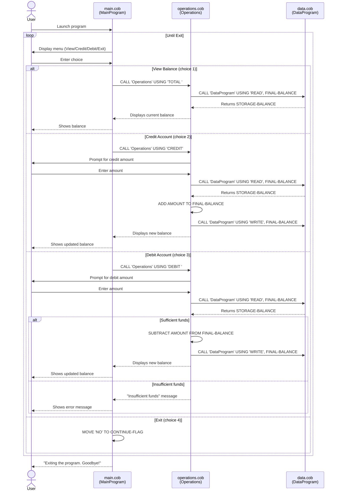

# Mergington High School — Legacy COBOL Accounting System

## Overview

This document describes the legacy COBOL-based accounting system used by Mergington High School to manage student fees, cafeteria accounts, and school supplies purchases. The system is composed of three COBOL source files located in `src/cobol/`.

---

## File Descriptions

### `src/cobol/main.cob` — Entry Point / User Interface

**Program ID:** `MainProgram`

This is the main entry point of the application. It presents a text-based menu to the user and routes input to the appropriate operation.

**Menu Options:**
| Choice | Action |
|--------|--------|
| 1 | View Balance |
| 2 | Credit Account |
| 3 | Debit Account |
| 4 | Exit |

**Key Logic:**
- Loops continuously using a `CONTINUE-FLAG` variable until the user selects "Exit".
- Delegates all operations to the `Operations` subprogram via `CALL 'Operations' USING <operation-type>`.

---

### `src/cobol/operations.cob` — Business Logic Layer

**Program ID:** `Operations`

This file contains the core business logic for each account operation. It receives an operation type string from `main.cob` and executes the corresponding logic.

**Operations Handled:**
| Operation Code | Description |
|----------------|-------------|
| `TOTAL ` | Read and display the current balance |
| `CREDIT` | Accept a credit amount, add it to the balance, and save |
| `DEBIT ` | Accept a debit amount, check for sufficient funds, subtract, and save |

**Key Business Rules:**
- A debit will only be processed if `FINAL-BALANCE >= AMOUNT`; otherwise, an "Insufficient funds" message is displayed.
- Both credit and debit operations call `DataProgram` to read the current balance before modifying it, ensuring the latest stored value is used.
- The initial in-memory balance is set to `1000.00` as a default working value.

---

### `src/cobol/data.cob` — Data Storage Layer

**Program ID:** `DataProgram`

This file acts as a simple in-memory data store for the account balance. It supports two operations passed via the `PASSED-OPERATION` parameter:

| Operation Code | Description |
|----------------|-------------|
| `READ` | Copy `STORAGE-BALANCE` into the caller's `BALANCE` variable |
| `WRITE` | Copy the caller's `BALANCE` value into `STORAGE-BALANCE` |

**Key Business Rules:**
- The default starting balance is `1000.00`.
- Balance data is held **in-memory only** — there is no file or database persistence. Data resets each time the program is run.
- The balance field supports up to 6 integer digits and 2 decimal places (`PIC 9(6)V99`).

---

## Key Business Requirements

1. **View Balance** — Users can check the current account balance at any time.
2. **Credit Account** — Users can add funds to the account; the balance is updated and confirmed.
3. **Debit Account** — Users can withdraw funds; the system enforces a non-negative balance constraint.
4. **Graceful Exit** — The system can be exited cleanly from the menu.
5. **Sufficient Funds Check** — Debits are rejected if the requested amount exceeds the current balance.

---

## System Architecture

The application follows a simple three-tier layered structure:

- **Presentation Layer** — `main.cob` (menu and user input)
- **Business Logic Layer** — `operations.cob` (credit, debit, balance logic)
- **Data Layer** — `data.cob` (in-memory balance storage)

---

## Data Flow Sequence Diagram

